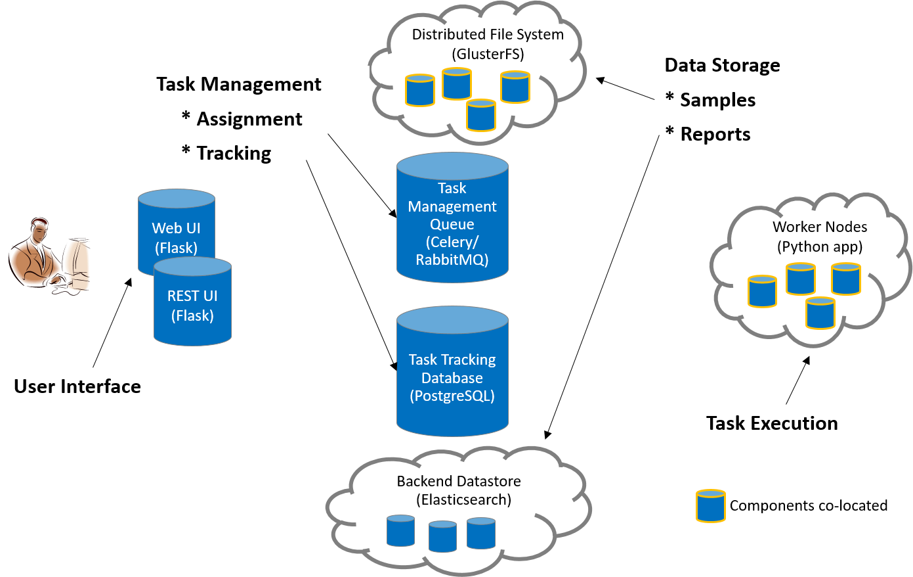
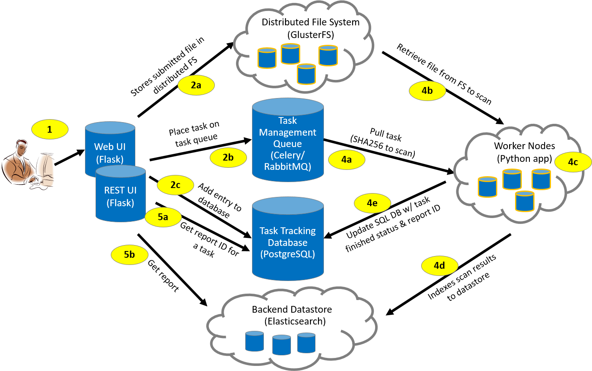

High-level Architecture
-----------------------
Details on the components of the MultiScanner architecture are given below the diagram. 

- **Web Frontend**  
The web application runs on [Flask](http://flask.pocoo.org/), uses [Bootstrap](https://getbootstrap.com/) and [jQuery](https://jquery.com/), and served via Apache. It is essentially an aesthetic wrapper around the REST API; all data and services provided are also available by querying the REST API.

- **REST API**  
The REST API is also powered by Flask and served via Apache. It has an underlying PostgreSQL database in order to facilitate task tracking. Additionally, it acts as a gateway to the backend ElasticSearch document store. Searches entered into the web UI will be routed through the REST API and passed to the ElasticSearch cluster. This abstracts the complexity of querying ElasticSearch and gives the user a simple web interface to work with.

- **Task Queue**  
We use Celery as our distributed task queue.

- **Task Tracking**  
PostgreSQL is our task management database. It is here that we keep track of scan times, samples, and the status of tasks (pending, complete, failed).

- **Distributed File System**  
GlusterFS is our distributed file system. Each component that needs access to the raw samples mounts the share via FUSE. We selected GlusterFS because it is much more performant in our use case of storing a large number of small samples than a technology like HDFS would be.

- **Worker Nodes**  
The worker nodes are Celery clients running the MultiScanner Python application. Additionally, we implemented some batching within Celery to improve the performance of our worker nodes (which operate better at scale). A worker node will wait until there are 100 samples in its queue or 60 seconds have passed (whichever happens first) before kicking off its scan (these values are configurable). All worker nodes have the GlusterFS mounted, which gives access to the samples for scanning. In our setup, we co-locate the worker nodes with the GlusterFS nodes in order to reduce the network load of workers pulling samples from GlusterFS.

- **Report Storage**  
We use ElasticSearch to store the results of our file scans. This is where the true power of this system comes in. ElasticSearch allows for performant, full text searching across all our reports and modules. This allows fast access to interesting details from your malware analysis tools, pivoting between samples, and powerful analytics on report output.

Complete Workflow
-----------------
Each step of the MultiScanner workflow is described below the diagram.

1. The user submits a sample file through the Web UI (or REST API).
1. The Web UI (or REST API):  
  a\. &nbsp; Stores the file in the distributed file system (GlusterFS)   
  b\. &nbsp; Places the task on the task queue (Celery)  
  c\. &nbsp; Adds an entry to the task management database (PostgreSQL)  
1. A worker node:  
  a\. &nbsp; Pulls the task from the Celery task queue  
  b\. &nbsp; Retrieves the corresponding sample file from the GlusterFS via its SHA256 value  
  c\. &nbsp; Analyses the file  
  d\. &nbsp; Generates a JSON blob and indexes it into Elasticsearch  
  e\. &nbsp; Updates the task management database with the task status ("complete")      
1. The Web UI (or REST API):  
  a\. &nbsp; Gets report ID associated with the Task ID  
  b\. &nbsp; Pulls analysis report from the Elasticsearch datastore  

Analysis Modules
----------------
MultiScanner is a file analysis framework that assists the user in evaluating malware samples by automatically running a suite of tools and aggregating the output. Tools can be custom built python scripts, web APIs, or software applications running on different machines. 
Analysis tools are integrated into MultiScanner via modules running in the MultiScanner framework. Existing module catagories include AV scanning, sandbox detonation, metadata extraction, and signature scanning. Modules can be enabled/disabled via a configuration file. Details are provided in the [Using MultiScanner](using#default-analysis-modules) section.

Analytics
---------
Enabling analytics and advanced queries is the primary advantage of running 
several tools against a sample, extracting as much information as possible, and
storing the output in a common datastore. The following are examples of analytics and queries:

- cluster samples
- outlier samples
- samples for deep-dive analysis
- gaps in current toolset
- machine learning analytics on tool outputs
- others

Reporting
---------
Analysis data captured or generated by MultiScanner is accessible in three ways:

* MultiScanner Web User Interface – Content in the Elasticsearch database is viewable through the Web UI. See the [Using MultiScanner](using.md#web-user-interface) section for details. 

* MultiScanner Reports – MultiScanner reports reflect the content of the MultiScanner database and are provided in raw JSON reports. These reports capture all content associated with a sample.

* *STIX-based reports are available in multiple formats: JSON, PDF, HTML, and text.* 