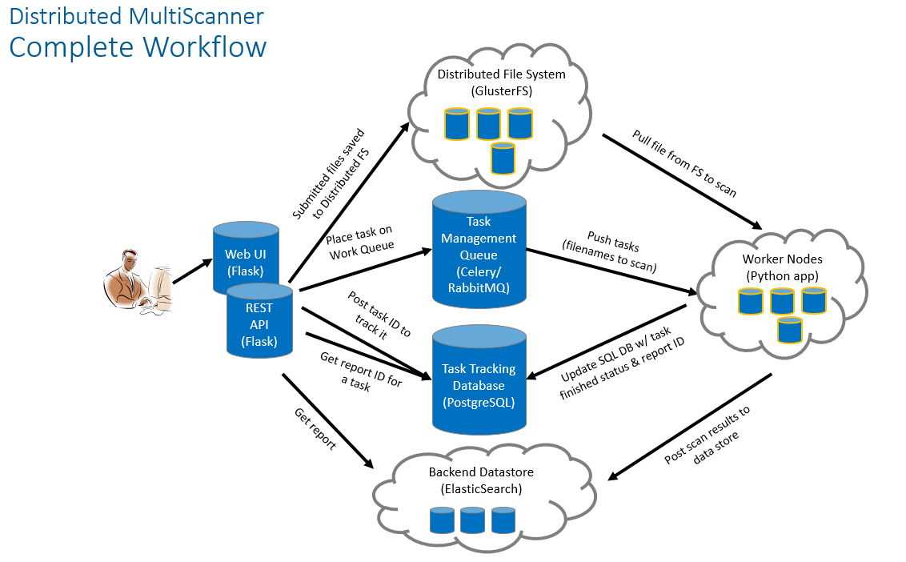

# Distributed MultiScanner #
MultiScanner is a file analysis framework that assists the user in evaluating a set of files by automatically running a suite of tools for the user and aggregating the output. Tools can be custom built python scripts, web APIs, software running on another machine, etc. Tools are incorporated by creating modules that run in the MultiScanner framework.

Modules are designed to be quickly written and easily incorporated into the framework. Currently written and maintained modules are related to malware analytics, but the framework is not limited to that scope. For a list of modules you can look in [modules](../modules), descriptions and config options can be found in [modules.md](modules.md).

MultiScanner also supports a distributed workflow for sample storage, analysis, and report viewing. This functionality includes a web interface, a REST API, a distributed file system (GlusterFS), distributed report storage / searching (ElasticSearch), and distributed task management (Celery / RabbitMQ).

## Intended Use case ##
Distributed MultiScanner is intended to solve any combination of these problems / use cases:

* Malware repository (i.e, long term storage of binaries and metadata)
* Scalable analysis capabilities
  * Every component of the Distributed MultiScanner is designed with scale in mind
  * Note this does not include the following:
    * The scaling of external malware analysis tools such as Cuckoo
    * Does not perform auto-scaling (e.g. auto-provisioning of VM’s, etc)
      * New nodes must be deployed manually and added to the Ansible playbook to receive the proper configurations
* Enable analytics on malware samples
  * Either by interacting with the ElasticSearch backend or plugging into the web / REST UI
  * Cyber Threat Intelligence (CTI) integration / storage
* Export CTI
  * Intend to output reports in multiple formats: STIX, MAEC, PDF, HTML, and JSON
    * Currently support JSON, MAEC 5.0, and HTML
  * Enables sharing of malware analysis results
* Support file submission types:
  * Currently support all file formats (e.g. PE, PDF, Office, etc…)
  * Currently doesn’t support extraction of files from PCAP / memory dumps / other data streams (but this is in the dev plan)
* Intended users:
  * Security Operations Centers (SOCs)
  * Malware analysis centers
  * CTI sharing organizations

## Architecture ##
This is the current architecture:

When a sample is submitted (either via the web UI or the REST API), the sample is saved to the distributed file system (GlusterFS), a task is added to the distributed task queue (Celery), and an entry is added to the task management database (PostgreSQL). The worker nodes (Celery clients) all have the GlusterFS mounted, which gives them access to the samples for scanning. In our setup, we colocate the worker nodes with the GlusterFS nodes in order to reduce the network load of workers pulling samples from GlusterFS. When a new task is added to the Celery task queue, one of the worker nodes will pull the task and retrieve the corresponding sample from the GlusterFS via its SHA256 value. The worker node then performs the scanning work. Modules can be enabled / disabled via a configuration file. This configuration file is distributed to the workers by Ansible at setup time (details on this process later). When the worker finishes its scans, it will generate a JSON blob and index it into ElasticSearch for permanent storage. It will then update the task management database with a status of "Complete". The user will then be able view the report via the web interface or retrieve the raw JSON.

## Setup ##
Currently, we deploy this system with Ansible. More information about that process can be found [here](https://github.com/mitre/multiscanner-ansible). We are also currently working to support deploying the distributed architecture via Docker. If you wish to get an idea of how the system works without having to go through the full process of setting up the distributed architecture, look into our docker containers for a standalone [system](docker_standalone.md). Obviously, the standalone system will be far less scalable / robust / feature-rich. However, it will stand up the web UI, the REST API, and an ElasticSearch node for you to see how the system works. The standalone container is intended as an introduction to the system and its capabilities, but not designed for use in production.

## Architecture Details ##
What follows is a brief discussion of the tools and design choices we made in the creation of this system.

### Web Frontend ###
The web application runs on [Flask](http://flask.pocoo.org/), uses [Bootstrap](https://getbootstrap.com/) and [jQuery](https://jquery.com/), and served via Apache. It is essentially an aesthetic wrapper around the REST API; all data and services provided are also available by querying the REST API.

### REST API ###
The REST API is also powered by Flask and served via Apache. It has an underlying PostgreSQL database in order to facilitate task tracking. Additionally, it acts as a gateway to the backend ElasticSearch document store. Searches entered into the web UI will be routed through the REST API and passed to the ElasticSearch cluster. This abstracts the complexity of querying ElasticSearch and gives the user a simple web interface to work with.

### Task Queue ###
We use Celery as our distributed task queue. 

### Task Tracking ###
PostgreSQL is our task management database. It is here that we keep track of scan times, samples, and the status of tasks (pending, complete, failed).

### Distributed File System ###
GlusterFS is our distributed file system. Each component that needs access to the raw samples mounts the share via FUSE. We selected GlusterFS because it is much more performant in our use case of storing a large number of small samples than a technology like HDFS would be.

### Worker Nodes ###
The worker nodes are simply Celery clients running the MultiScanner Python application. Addtionally, we implemented some batching within Celery to improve the performance of our worker nodes (which operate better at scale). Worker nodes will wait until there are 100 samples in its queue or 60 seconds have passed (whichever happens first) before kicking off its scan. These figures are configurable.OB

### Report Storage ###
We use ElasticSearch to store the results of our file scans. This is where the true power of this system comes in. ElasticSearch allows for performant, full text searching across all our reports and modules. This allows fast access to interesting details from your malware analysis tools, pivoting between samples, and powerful analytics on report output.
