# Web Interface #

Submit Files for Analysis
-------------------------

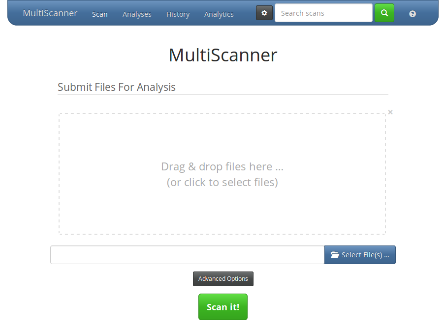

When you visit MultiScanner's web interface in a web browser, you'll be greeted by the file submission page. Drag files onto the large drop area in the middle of the page or click it or the "Select File(s)..." button to select one or more files to be uploaded and analyzed.

Click on the "Advanced Options" button to change default options and set metadata fields to be added to the scan results.

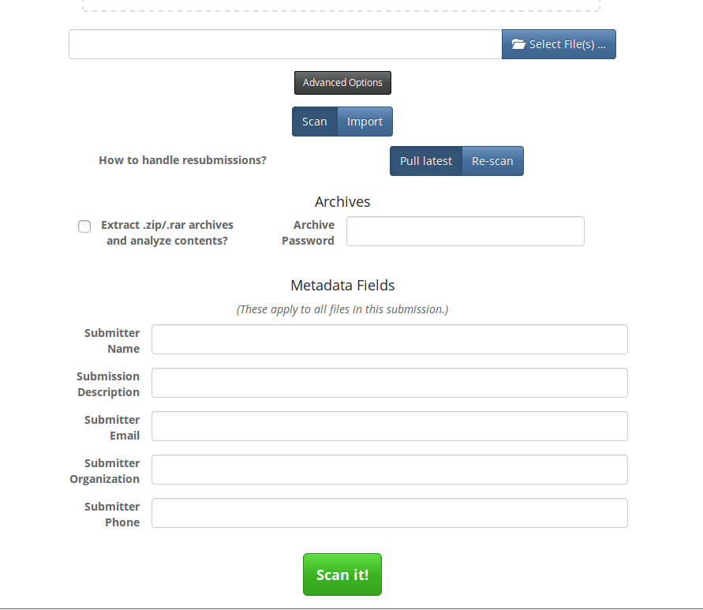

Metadata fields can be added or removed by editing web_config.ini. Metadata field values can be set for individual files by clicking the small black button below and to the right of that filename in the staging area.

Change from "Scan" to "Import" to import JSON analysis reports into MultiScanner.  This is intended only to be used with the JSON reports you can download from a report page in MultiScanner.

By default, if you resubmit a sample that has already been submitted, MultiScanner will pull the latest report of that sample. If you want MultiScanner to re-scan the sample, set that option in Advanced Options.

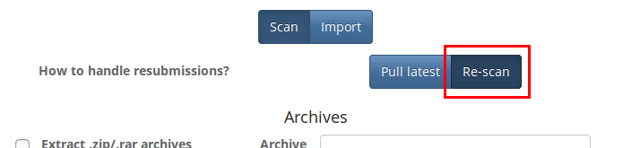

If you have a directory of samples you wish to scan at once, we recommend zipping them and uploading the archive with the option to extract archives enabled. You can also specify a password, if the archive file is password- protected. Alternatively you can use the REST API for bulk uploads.

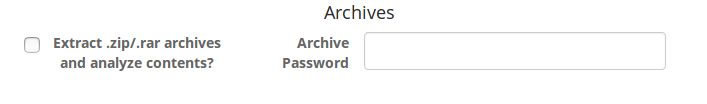

Click the "Scan it!" button to submit the sample to MultiScanner.

The progress bars that appear in the file staging area do not indicate the progress of the scan; a full bar merely indicates that the file has been uploaded to MultiScanner. Click on the file to go to its report page.

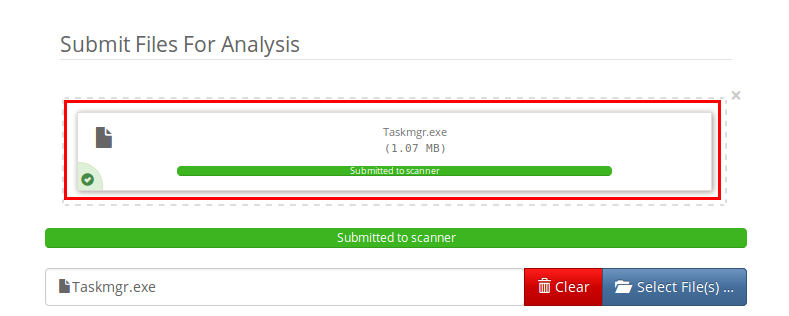

If the analysis has not completed yet, you'll see a "Pending" message.

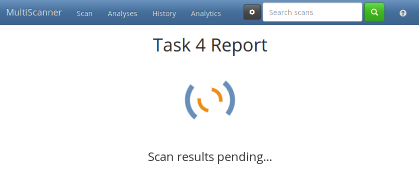

Analyses and History Pages
--------------------------

Reports can be listed and searched in two different ways. The Analyses page lists the most recent report per sample.

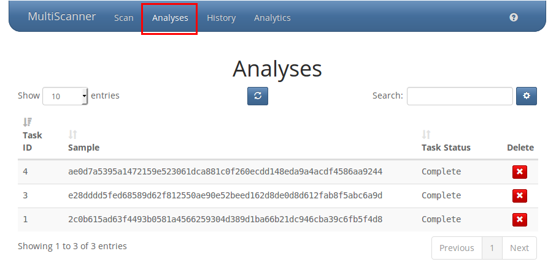

The History page lists every report of each sample. So if a file is scanned multiple times, it will only show up once on the Analyses page, but all of the reports will show up on the History page.

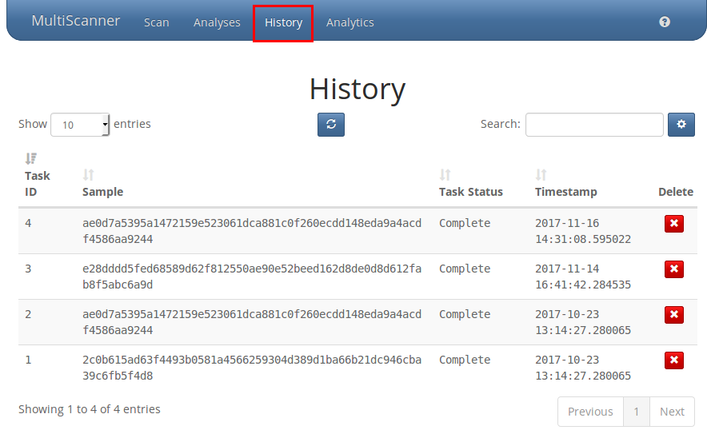

Both pages display the list of reports and allow you to search them. Click the blue button in the middle to refresh the list of reports.

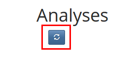

Click on a row in the list to go to that report, and click the red "X" button to delete that report from MultiScanner's Elasticsearch database.

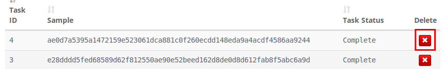

Searching
---------

Reports can be searched from any page, with a few options. You can search Analyses to get the most recent scan per file, or search History to get all scans recorded for each file. Use the "Default" search type to have wildcards automatically appended to the beginning and end of your search term. Use the "Exact" search type to search automatically append quotes and search for the exact phrase. Finally, use the "Advanced" search type to search with the full power of Lucene query string syntax. Nothing will be automatically appended and you will need to escape any reserved characters yourself. When you click on one of the search results, the search term will be highlighted on the Report page and the report will be expanded and automatically scrolled to the first match.

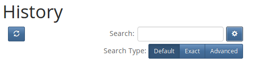

Report page
-----------

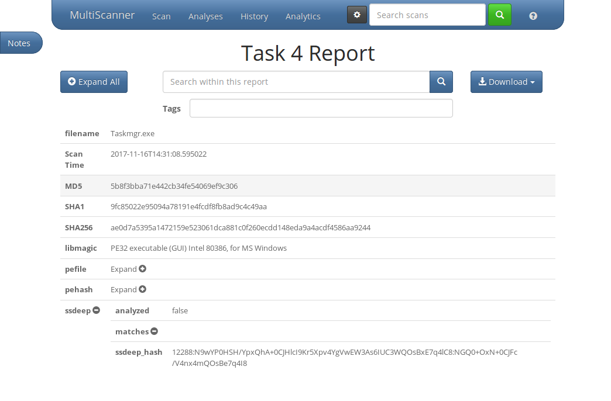

Each report page displays the results of a single analysis. Some rows in the report can be expanded or collapsed to reveal more data by clicking on the row header or the "Expand" button. Shift-clicking will also expand or collapse all of it's child rows.

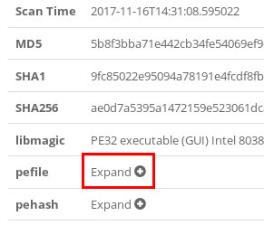

The "Expand All" button will expand all rows at once. If they are all expanded, this will turn into a "Collapse All" button that will collapse them all again.

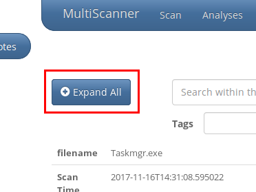

As reports can contain a great deal of content, you can search the report to find the exact data you are looking for with the search field located under the report title. The search term, if found, will be highlighted, the matching fields will be expanded, and the page automatically scrolled to the first match.

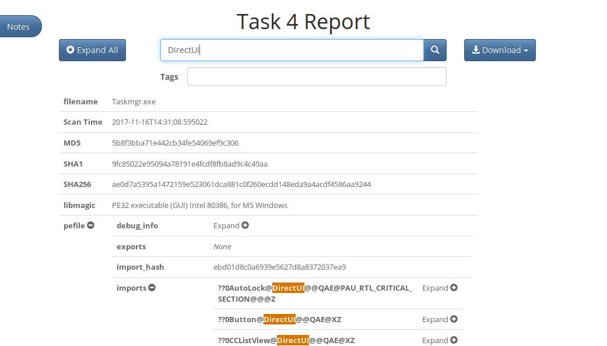

Reports can be tagged by entering text in the Tags input box and hitting the enter key. As you type, a dropdown will appear with suggestions from the tags already in the system. It will pull the list of tags from existing reports, but a pre-populated list of tags can also be provided in web_config.ini when the web interface is set up.

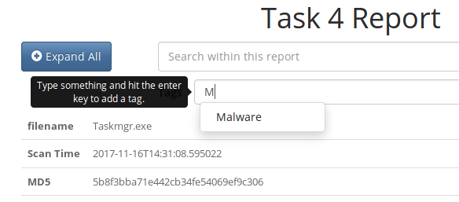

You can download the report in a number of different formats using the Download button on the right side. You can download a JSON-formatted version of the report containing all the same data shown on the page. You can also download a MAEC-formatted version of the reports from Cuckoo Sandbox. Finally, you can also download the original sample file as a password-protected ZIP file. The password will be "infected".

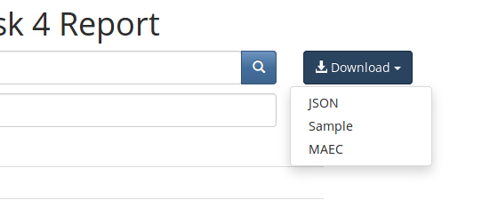

Click on "Notes" to open a sidebar where analysts may enter notes or comments.

These notes and comments can be edited and deleted. Click the "<" button to collapse this sidebar.

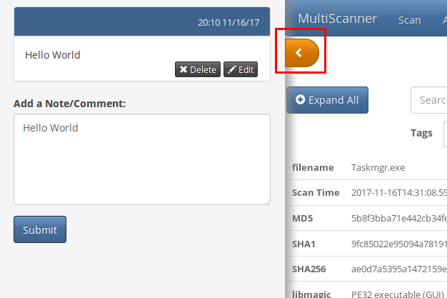

Analytics
---------

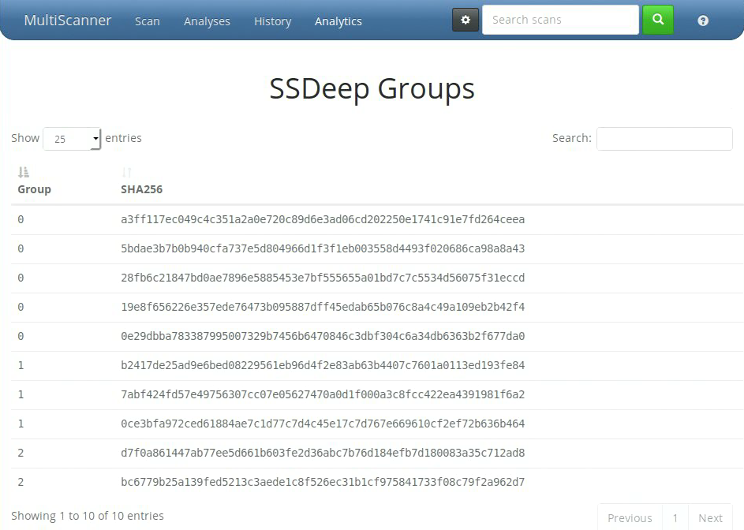

The Analytics page displays various pieces of advanced analysis. For now, this is limited to ssdeep comparisons. The table lists samples, with those that have very similar ssdeep hashes grouped together. Other analytics will be added in the future. For more information, see [this page](../docs/analytics.md).
